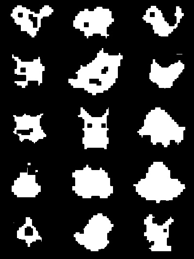

##### Obraz oryginalny

```python
cv2.imshow("Image",image)
```

imshow wyświetla obraz


##### Kawałek obrazu

```python
piece = image[800:900,1400:1600]
cv2.imshow("Leaf", piece)
```


##### Zmiana rozdzielczości na stałą rozdzielczość

```python
resized = cv2.resize(image, (600, 600))
```

metoda resize zmienia rozdzielczość na podaną w tuplu


##### Zmiana rozdzielczośći z zachowaniem proporcji

```python
resized = imutils.resize(image, width=600)
```

funkcja resize z biblioteki imutils pozwala na zmianę szerokości lub wysokości zachowując proporcje


##### Rotacja obrazu


```python
rotated = imutils.rotate(image, 60)
```


imutlis.rotate pozwala na rotacje obrazu domyślnie wobec środka


##### Rotacja obrazu w jego granicach

```python
rotated = imutils.rotate_bound(image, 45)
```


Funkcja zwiększa także wymiary obrazu aby cały zmieścił się w oknie


##### Rozmycie obrazu

```python
blurred = cv2.GaussianBlur(image, (15, 15), 0)
```

Rozmycie używając filtra gaussa

wysokość i szerokość kernela odpowiada za moc rozmycia, rozmiary mogą się różnić ale muszą być nieparzyste lub być zerem. ostatni parametr sigma określa odchylenie standardowe w płaszczyźnie x. 


##### Rysowanie na obrazie

```python
output = image.copy()
h,w,d=image.shape
cv2.circle(output,(int(w/2)-200,int(h/2)-200),50, (0, 0, 0), 5)
cv2.line(output,(int(w/2)-150,int(h/2)-220),(int(w/2)-100,int(h/2)),(0,0,0),5)
cv2.rectangle(output,(int(w/2)-100,int(h/2)),(int(w/2)+100,int(h/2)+200),(0,0,255),25)
cv2.putText(output, "That's a nice game", (int(w/2),500),cv2.FONT_ITALIC,2.5, (123, 214, 15), 7)
```

kolor i grubość lini trzeba podać w każdej z metod. 

W okręgu trzeba wskazać środek i jego promieć.

W linii i prostokącie należy podać punk startowy i końcowy

W tekście podaje się punkt startowy, font i rozmiar. Font można wybrać z biblioteki openCV lub inny używając innych bibliotek np PIL


##### Zamiana kolorów w odcienie szarości

```python
gray = cv2.cvtColor(image, cv2.COLOR_BGR2GRAY)
```

Metoda cvtColor pozwala na zmianę kolorów w zależności od podanej przestrzeni kolorów, w tym przypadku w odcienie szarości


##### Wykrywanie krawędzi


```python
edged = cv2.Canny(gray, 50, 150)
```

Algorytm Canny pozwala na wykrycie krawędzi w obrazach, jako argumenty podaję się niski i wysoki próg dla pikseli. Oblicza się gradient dla każdego piksela i jeśli gradient dla danego piksela w wykrytm wcześniej progu będzie większy niż wysoki próg zostanie on zaliczony do krawędzi, a niższy niż niski próg zostanie odrzucony


##### Thresholding obrazu


```python
thresh = cv2.threshold(gray, 240, 255, cv2.THRESH_BINARY_INV)[1]
```

Funkcja pozwala na uzyskanie obrazu w 2 kolorach z obrazu w odcieniach szarości w celu lub odfiltrowaniu pixeli ze zbyt małymi lub dużymi wartościami. Piksele z mniejszą wartością od podanego w argumencie progu w tym przypadku 240 są zamieniane w kolor biały a reszta w kolor czarny


##### Znajdowanie i rysowanie konturów


```python
cnts = cv2.findContours(thresh.copy(), cv2.RETR_EXTERNAL,
	cv2.CHAIN_APPROX_SIMPLE)
cnts = imutils.grab_contours(cnts)
```

findContours znajduje kontury z obrazu binarnego wykorzystując algorytm suzuki85 


```python
cv2.drawContours(output, cnts, -1, (255, 0, 0), 2)
```

metoda rysuje kontury, jako argumenty podaje się obraz wejściowy, listę wykrytych konturów, indeks kontury do rysowania (jeśli ujemny rysuje wszystkie), kolor i grubość linii


##### Erozja


```python
mask = thresh.copy()
mask = cv2.erode(mask, None, iterations=3)
```

Metoda pozwala na usunięcie szumów powstałych w procesie tresholdingu 




##### Dylatacja

```
mask = thresh.copy()
mask = cv2.dilate(mask, None, iterations=5)
```

Dylatacja pozwala na wypełnienie "dziur" w niespójnym obrazie przez zapełnienie ich białymi pikselami. Do boku białego piksela jest dodawany kolejny. Można także określić ilość iteracji


##### Operacje binarne na obrazie

```python
mask = thresh.copy()
output = cv2.bitwise_and(image, image, mask=mask)
```

metoda bitwise_and oblicza logiczną operacje and z 2 macierzy, podanie maski pozwala na określenie elementów wyjściowej macierzy, które mają zostać zmienione. 

